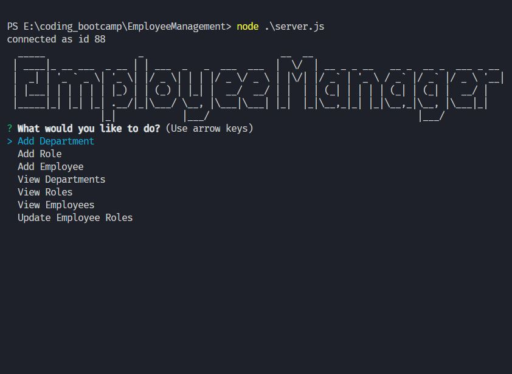
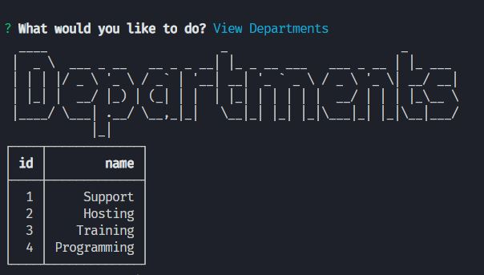
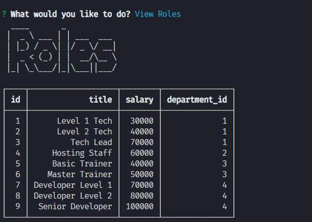
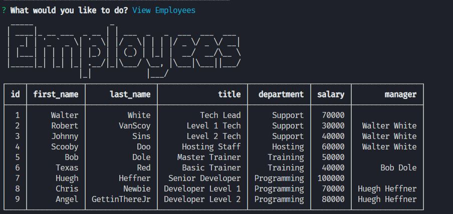
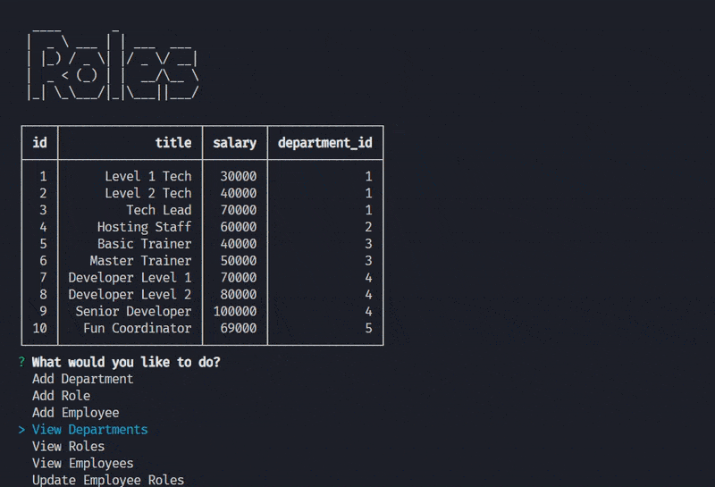

# Employee Management System
## by Robert VanScoy
_______________________________________________________________
### Description 
* This program allows a company to manage employees using node, inquirer, and MySQL.
  
### License : 

  
* Info on license: https://opensource.org/licenses/MIT
_______________________________________________________________
### Installation Instructions:

* Install node dependencies : inquirer, mysql, console.table . Also be sure to seed database so CLI will have data to work with.

_______________________________________________________________

### Demo:
* https://youtu.be/B9lgCpPGvjQ

_______________________________________________________________

* Main Menu

_______________________________________________________________

* View Departments

_______________________________________________________________

* View Roles

_______________________________________________________________

* View Employees

_______________________________________________________________

* GIF showcasing app in action

_______________________________________________________________

### Main Language : 
* node.js

### Contribution Policy: 
* Open to collaboration, just email me.
_______________________________________________________________
### Test Cases:
* N/A
_______________________________________________________________
### Contact Me 

* https://github.com/vanscoyro
* rvans003@fiu.edu

### TABLE OF CONTENTS 
_______________________________________________________________
* [Description](#description)
* [License](#license-)
* [Installation](#installation-instructions)
* [Demo](#demo)
* [Main Language](#main-language-)
* [Contribution Policy](#contribution-policy)
* [Test Case](#test-cases)
* [Contact Me](#contact-me)

    
  
